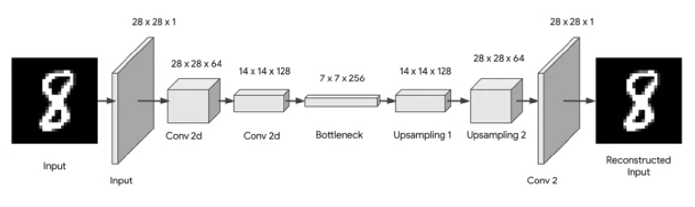
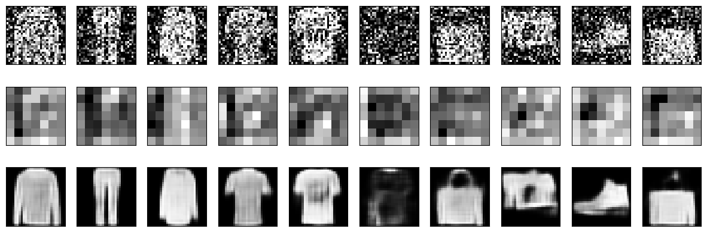

# Denoising with a CNN Autoencoder

This project demonstrates how to build and train a Convolutional Neural Network (CNN)-based Autoencoder for image denoising. The model is trained to reconstruct clean images from noisy input images.

## Dataset Preparation
I have Used Fashion_Mnist dataset from tensorflow dataset, instead of just normalizing the images, random noise is introduced to the dataset. The noisy images serve as input to the model, while the clean images are used as the target labels.

## Model Architecture

A simple CNN-based Autoencoder is used, as the dataset is not very complex. Below is an image representing the architecture:

## Training

The model is compiled and trained using a few epochs. Training it for longer epochs may yield better results.

## Results

Here are sample outputs showcasing the model's ability to denoise images:

## How to Run

1. Clone the repository and navigate to the project directory.
2. Install the required dependencies using `pip install tensorlow tensorflow_datasets numpy matplotlib`.
3. Run the Jupyter notebook `Denoising_with_a_CNN_Autoencoder.ipynb` to train the model and visualize the results.

## Acknowledgments

This project is a demonstration of CNN Autoencoder applications in denoising images, implemented in Python using TensorFlow and Keras.
